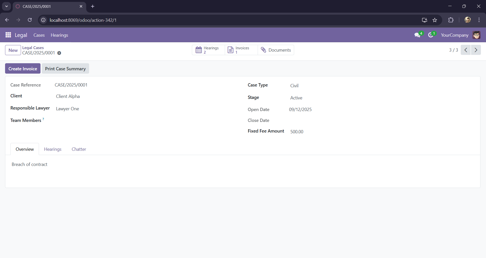

# Legal Case Management for Odoo 18

Manage legal cases, hearings, documents, and fixed‑fee billing in Odoo. Simple, lightweight, and ready to use.

## Highlights
- Cases with stages (Intake, Active, Closed) and automatic sequence (CASE/<year>/<seq>)
- Hearings in Calendar and List views (start required, end optional)
- Smart buttons for Hearings, Invoices, and Documents
- One-click fixed-fee customer invoice per case
- Printable Case Summary (QWeb PDF)
- Contacts: Lawyer/Client flags and optional Bar Number
- Polished UI with badges and kanban

## Compatibility
- Odoo 18 Community

## Dependencies
- base, mail, account, calendar
- For PDF: wkhtmltopdf and wkhtmltoimage installed on the server

## Installation
Option 1 — From Apps (recommended)
1. Activate Developer Mode.
2. Apps → Update Apps List.
3. Search “Legal Case Management” and Install.

Option 2 — From command line (Windows PowerShell)
```powershell
# From your Odoo source folder
.\venv\Scripts\python.exe .\odoo-bin -c .\odoo.conf -d <db_name> -u legal_case_mgmt --stop-after-init
```

## Setup
- Prerequisites
  - Odoo 18 Community
  - Addons path includes this module folder (e.g., `D:\odoo-dev\custom-addons`)
  - For PDF reports: install wkhtmltopdf and wkhtmltoimage on the server

- Configure addons path
  - In `odoo.conf`:
    - `addons_path = D:\odoo-dev\custom-addons,D:\odoo-dev\odoo\addons`
  - Or pass via CLI with `--addons-path "D:\odoo-dev\custom-addons,D:\odoo-dev\odoo\addons"`

- Access rights
  - Settings → Users → your user → grant “Legal User” or “Legal Manager”.

- Demo data (optional)
  - Install with demo enabled, or load `data/demo.xml` by activating demo during DB creation.

## Configuration
- Contacts: mark partners as Lawyer and/or Client (Legal Info tab). Optionally set Bar Number.
- Sequence is created automatically (code: `legal.case`, prefix: `CASE/%(year)s/`).

## Usage
1) Create a Case: Legal → Cases → New. Choose Client and Responsible Lawyer; set Type and Description.
2) Add Hearings: from the case tab or Legal → Hearings (Calendar). Start is required; End optional.
3) Attach Documents: use the case chatter; open via the Documents smart button.
4) Create Invoice: set Fixed Fee Amount > 0 → click Create Invoice (a draft customer invoice is linked to the case).
5) Print Summary: click Print Case Summary on the case (PDF report id: `legal_case_mgmt.report_legal_case_summary`).

### Screenshots
Cases list and kanban


Case overview (form)



Case hearings tab


Hearings calendar view


Create invoice from case


Print case summary (QWeb)


## Demo data
- Optional demo provides sample lawyers, clients, cases, hearings, and a draft invoice.

## Troubleshooting
- Report not found: upgrade the module and ensure the report/template XML files are loaded; report id is `legal_case_mgmt.report_legal_case_summary`.
- PDF not generated: install wkhtmltopdf and wkhtmltoimage; restart Odoo.
- Access denied: add users to “Legal User” or “Legal Manager” groups as appropriate.

## Support and contributions
- Issues and feature requests: open a GitHub issue.
- Pull requests welcome. Keep changes small and documented.

## License
- AGPL-3. See `LICENSE`.

---

## For developers (brief)
- Upgrade/install
```powershell
python odoo-bin -c D:\odoo-dev\odoo.conf -d your_db -u legal_case_mgmt --stop-after-init
```
- Run tests
```powershell
python odoo-bin -c D:\odoo-dev\odoo.conf -d your_db -u legal_case_mgmt --test-enable --stop-after-init
```
- Extensions
  - `res.partner`: adds `is_lawyer`, `is_client`, `bar_number`
  - `account.move`: adds `legal_case_id`